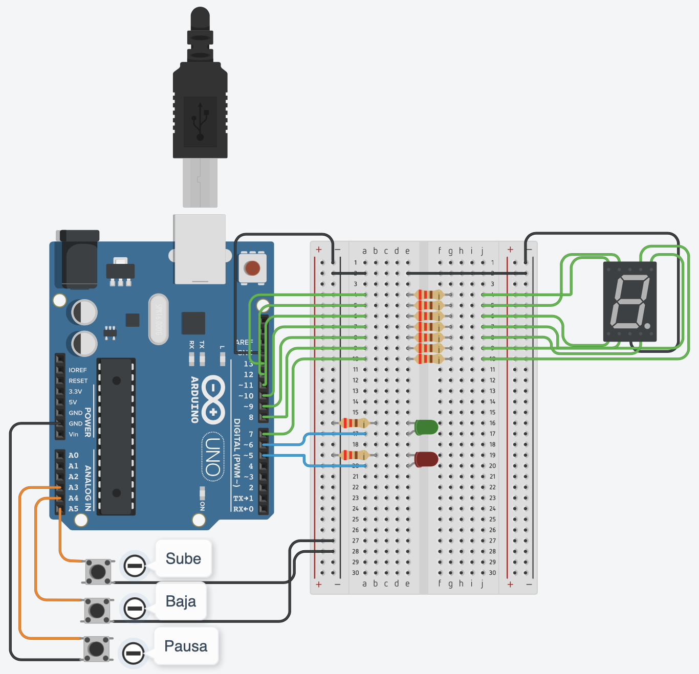

## 📋 Documentación de la parte práctica del primer parcial para la materia Sistemas de procesamiento de datos - UTN Tecnicatura Superior en Programación.  

Desafio donde se busca simular el recorrido de un montacargas.

 
## Proyecto: Montacargas.

***

## Comenzando 🚀
***

En este proyecto simula el ascenso, descenso y pausa de un montacargas/elevador:
- Al presionar el pulsador de subir, da comienzo a la simulación y sube de a un piso a la vez.
- Al presionar el pulsador de bajar, baja un piso a la vez.
- Al presionar el pulsador de pausar, frena el sistema y el montacargas se queda en la posición a la espera de una nueva indicación.
- El sistema consta de 2 leds indicadores:   
  - Led verde indica que el montacargas está subiendo.
  - Led rojo indica que el pulsador de pausa ha sido presionado y se frenó el sistema.  

[Link del proyecto en Tinkercad ](https://www.tinkercad.com/things/13dhFNJBz53?sharecode=SiTig1GAiG8UVaN78oe8jJpEupKP30JCmkHKZclBln4 "Enlace del proyecto en Tinkercad")

## Consigna 🔩

Consigna Montacargas:

Para realizar el proyecto deberán usar mínimamente:  
1 ARDUINO UNO.  
1 Display 7 segmentos.  
2 LEDS.    
3 BOTONES  
RESISTENCIAS NECESARIAS PARA CADA COMPONENTE.

## Código del programa: 🔩

* * *

 ~~~ C (Lenguaje del código)
#define ledVerde 6
#define ledRojo 5
#define P_SUBE 19
#define P_BAJA 18
#define P_PAUSA 17
#define A 7
#define B 8
#define C 9
#define D 10
#define E 11
#define F 12
#define G 13

int contador = 0;
String mensaje = "";
int estadoBotonSubir = digitalRead(P_SUBE);
int estadoBotonBajar = digitalRead(P_BAJA);
int estadoBotonPausa = digitalRead(P_PAUSA);

void setup()
{
  Serial.begin(9600);
  pinMode(ledVerde, OUTPUT);
  pinMode(ledRojo, OUTPUT);
  pinMode(P_SUBE, INPUT_PULLUP);
  pinMode(P_BAJA, INPUT_PULLUP);
  pinMode(P_PAUSA, INPUT_PULLUP);
  pinMode(A, OUTPUT);
  pinMode(B, OUTPUT);
  pinMode(C, OUTPUT);
  pinMode(D, OUTPUT);
  pinMode(E, OUTPUT);
  pinMode(F, OUTPUT);
  pinMode(G, OUTPUT);
}

// INICIO LOOP PRINCIPAL
void loop()
{
  estadoBotonSubir = digitalRead(P_SUBE); // 1 o 0
  estadoBotonBajar = digitalRead(P_BAJA);
  estadoBotonPausa = digitalRead(P_PAUSA);
  	  
  
  	  if (estadoBotonPausa == 0) 
      {
        pausarFuncionamiento();
      }
  	  if (estadoBotonSubir == 0)
      {
        moverUnPiso("asc",3000);
      }	
      else if (estadoBotonBajar == 0)
      {  
        moverUnPiso("desc",3000);
      }
  
} // FIN LOOP

// INICIO FUNCIONES
int moverUnPiso(String subirBajar, int tiempoDelay)
{
  	digitalWrite(ledRojo,0);
  	displayOff(); // Limpio display 7 segmentos.
  
  	if (subirBajar == "asc")
    {
      contador += 1; // Subo un piso
    } 
    else if (subirBajar == "desc")
    {
      contador -= 1; // Bajo un piso
    }
  
  if ( contador > 9){ // Valido que si quiere subir más del 9, se quede en el mismo piso.
  	contador--;
  } else if (contador < 0) // Valido que si quiere bajar más del 0, se quede en el mismo piso.
  {
  	contador++;
  }
    
  digitalWrite(ledVerde,1); // Se queda prendido hasta que termine el delay(mientras sube)
  
  Serial.println(contador);
  
  switch(contador) // El contador determina el piso a donde ir
  {
  	case 0:
    	actualizarDisplay(0);
    	mensaje = "Llego al piso 0.";
    	break;
    case 1:
    	actualizarDisplay(1);
      	mensaje = "Llego al piso 1.";
    	break;
    case 2:
    	actualizarDisplay(2);
        mensaje = "Llego al piso 2.";
    	break;
    case 3:
    	actualizarDisplay(3);
    	mensaje = "Llego al piso 3.";
    	break;
    case 4:
    	actualizarDisplay(4);
    	mensaje = "Llego al piso 4.";
    	break;
    case 5:
    	actualizarDisplay(5);
    	mensaje = "Llego al piso 5.";
    	break;
    case 6:
    	actualizarDisplay(6);
    	mensaje = "Llego al piso 6.";
    	break;
    case 7:
    	actualizarDisplay(7);
    	mensaje = "Llego al piso 7.";
    	break;
    case 8:
    	actualizarDisplay(8);
    	mensaje = "Llego al piso 8.";
    	break;
    case 9:
    	actualizarDisplay(9);
    	mensaje = "Llego al piso 9.";
    	break; 
  }
  
  delay(tiempoDelay);
  Serial.println(mensaje);
  digitalWrite(ledVerde,0);
  
  return contador;
}

void pausarFuncionamiento()
{
 	actualizarDisplay(contador + 1);
    digitalWrite(ledRojo,1);
    delay(100);
    mensaje = "Se freno el sistema, vuelva a presionar el boton para reanudar";
    Serial.println(mensaje);
}

void displayOff() // Limpia display 7 segmentos.
{
  digitalWrite(A, LOW);
  digitalWrite(B, LOW);
  digitalWrite(C, LOW);
  digitalWrite(D, LOW);
  digitalWrite(E, LOW);
  digitalWrite(F, LOW);
  digitalWrite(G, LOW);
}

void actualizarDisplay(int piso) {
  switch (piso) {
    case 1:
      digitalWrite(B, 1);
      digitalWrite(C, 1);
      break;
    case 2: 
	  digitalWrite(A, 1);
      digitalWrite(B, 1);
      digitalWrite(D, 1);
      digitalWrite(E, 1);
      digitalWrite(G, 1);
      break;
    case 3:
      digitalWrite(A, 1);
      digitalWrite(B, 1);
      digitalWrite(C, 1);
      digitalWrite(D, 1);
      digitalWrite(G, 1);
      break;
    case 4:
      digitalWrite(B, 1);
      digitalWrite(C, 1);
      digitalWrite(G, 1);
      digitalWrite(F, 1);
      break;
    case 5:
      digitalWrite(A, 1);
      digitalWrite(C, 1);
      digitalWrite(D, 1);
      digitalWrite(F, 1);
      digitalWrite(G, 1);
      break;
    case 6:
      digitalWrite(C, 1);
      digitalWrite(D, 1);
      digitalWrite(E, 1);
      digitalWrite(F, 1);
      digitalWrite(G, 1);
      break;
    case 7:
      digitalWrite(A, 1);
      digitalWrite(B, 1);
      digitalWrite(C, 1);
      break;
    case 8:
      digitalWrite(A, 1);
      digitalWrite(B, 1);
      digitalWrite(C, 1);
      digitalWrite(D, 1);
      digitalWrite(E, 1);
      digitalWrite(F, 1);
      digitalWrite(G, 1);
      break;
    case 9:
      digitalWrite(A, 1);
      digitalWrite(B, 1);
      digitalWrite(C, 1);
      digitalWrite(D, 1);     
      digitalWrite(F, 1);
      digitalWrite(G, 1);
      break;
  }
}
// FIN FUNCIONES
~~~

## 🤖 Link al proyecto 
---

 Proyecto [Montacargas ](https://www.tinkercad.com/things/13dhFNJBz53?sharecode=SiTig1GAiG8UVaN78oe8jJpEupKP30JCmkHKZclBln4 "Enlace del proyecto en Tinkercad") TinkerCad.
 - - - 

##  📘 Fuentes
---
- [Tecnicatura Universitaria en Programación - UTN](http://www.sistemas-utnfra.com.ar/#/pages/carrera/tecnico-programacion/resumen).

with ❤️ 